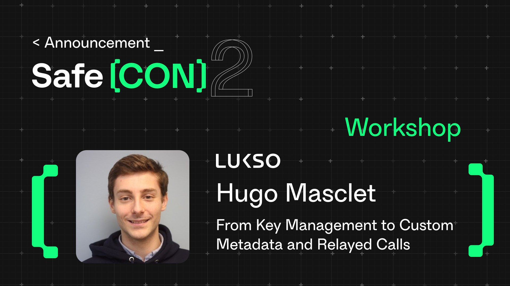

# [Safe{Con}2](https://conf.safe.global/) Workshop - From Key Management to Custom Metadata and Relayed Calls



## Program

The goal of this workshop is to present a few features enabled by account abstraction and the [LUKSO "Universal Profiles"](https://docs.lukso.tech/standards/universal-profile/introduction) standards.

### 🔑 Key Management

In this example we will present and demo the Key Manager (based on [LSP6](https://docs.lukso.tech/standards/universal-profile/lsp6-key-manager)).

### 📝 Custom Metadata

The LUKSO standards supports custom metadata (based on [ERC725Y](https://docs.lukso.tech/standards/lsp-background/erc725#erc725y-generic-data-keyvalue-store)). These metadata can be used for storing NFT information, profile information, received tokens, or anything you need.

### 📢 Relayed Calls

The LUKSO Universal Profile account (based on [LSP0](https://docs.lukso.tech/standards/universal-profile/lsp0-erc725account)) unlocks relayed calls capabilities and gasless transactions. This example will show how to relay a message.

## Getting started

### Prerequisites

- [Create a Universal Profile](https://my.universalprofile.cloud/) on mainnet or testnet.
- Send funds (LYX or [LYXt](https://faucet.testnet.lukso.network/)) to your controller address [[guide](https://support.lukso.network/general/getting-started/Extension/guides/fund-controller)].
- Familiar with the terminal, [Node.js](https://nodejs.org/en/download/package-manager), TypeScript.
- This repo uses `bun`, you can install it with:

```sh
curl -fsSL https://bun.sh/install | bash # for macOS, Linux, and WSL
```

👉 More information on the [Bun docs](https://bun.sh/docs/installation).

- `bun install`

Copy the env file and edit it:

- `cp .env.example .env`

- Fill the values in `.env`

| Variable                    | Description                                                                                                                     |
| --------------------------- | ------------------------------------------------------------------------------------------------------------------------------- |
| `UNIVERSAL_PROFILE_ADDRESS` | The address of your Universal Profile, created via the LUKSO extension.                                                         |
| `CONTROLLER_PRIVATE_KEY`    | The private key of the controller of your Universal Profile. Can be found in the extension via Settings -> Reveal Private Keys. |
| `TEST_PRIVATE_KEY`          | The private key of a test account used for demo purposes. Can be generated with the `src/utils/generateWallet.ts` script.       |
| `RELAY_CALL_PRIVATE_KEY`    | The private key of the account used to relay a call. Can be generated with the `src/utils/generateWallet.ts` script.            |

You can run the scripts with:

- `bun run src/XXX.ts`

## ✉️ Contact

- GitHub: [@Hugoo](https://github.com/Hugoo)
- X: [@HugoApps](https://x.com/HugoApps)
- Website: <https://hugomasclet.com>

## 🧑‍🎓 Resources

- [LUKSO Docs](https://docs.lukso.tech)
- [Block explorer](https://txs.app/)
