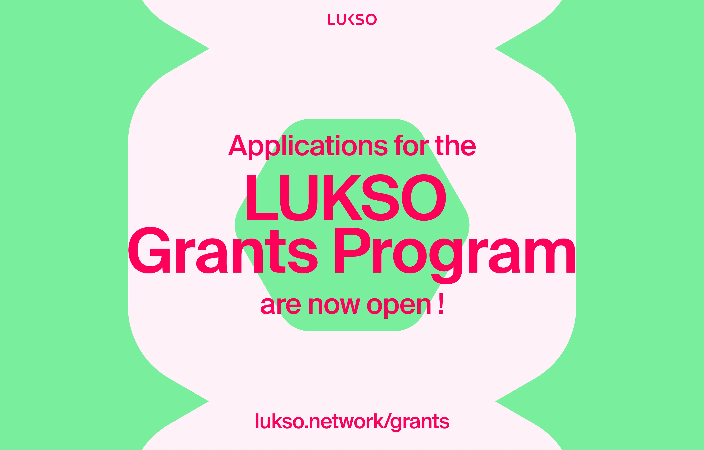

# Presentation

## About

## LUKSO

---

# Agenda

## 🔑 Key Management

## 📝 Custom Metadata

## 📢 Relayed Calls

---

# 🔑 Key Management

I need a base Universal Profile, Key Manager and key to perform the actions.

Add permissions to a KeyManager and demo working/non working transactions / Screenshot / Demo of the Extension?

Real life examples (marketplace etc.)

---

# 📝 Custom Metadata

Easy to write and decode with ERC725js -> show examples of existing collections with erc725inspect and demo how to write

---

# 📢 Relayed Calls

Show the relayer, from the extension to the dashboard

Execute a transaction on the behalf of someone, with the right permissions ofc?

---

# Conclusion

---

# What's next?

- Take a look to the [Grant Program](https://lukso.network/grants)

---

# Blockhaus Afterparty by LUKSO with Google Cloud, SheFi & Guild

- <https://lu.ma/ok55cmmf>

